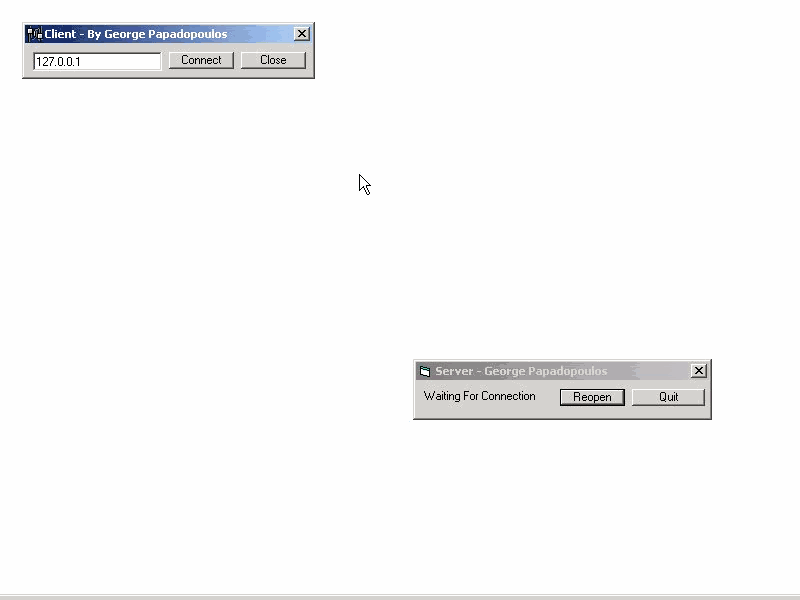



## A Great Internet Whiteboard

### Description

Internet Board Is A Program ( Client/Server ) That when a connection is established a form appears and whatever you draw on that form appears on the others person form with a diferent color..has the basic tools Pen And Line And If i get good rates i will Add more...its a good example that shows you how to your lines ,pset, winsocks....Have Fun :) and if you are a member PLEASE RATE MY PROJECT...:)...all comments are welcome :)
 
### More Info
 

             |
---                |---
**Submitted On**   |2005-01-16 10:27:02
**By**             |[George Papadopoulos  \- VirusFree](https://github.com/Planet-Source-Code/PSCIndex/blob/master/ByAuthor/george-papadopoulos-virusfree.md)
**Level**          |Beginner
**User Rating**    |4.7 (70 globes from 15 users)
**Compatibility**  |VB 5\.0, VB 6\.0
**Category**       |[Internet/ HTML](https://github.com/Planet-Source-Code/PSCIndex/blob/master/ByCategory/internet-html__1-34.md)
**World**          |[Visual Basic](https://github.com/Planet-Source-Code/PSCIndex/blob/master/ByWorld/visual-basic.md)
**Archive File**   |[A\_Nice\_Int974456222002\.zip](https://github.com/Planet-Source-Code/george-papadopoulos-virusfree-a-great-internet-whiteboard__1-36133/archive/master.zip)

